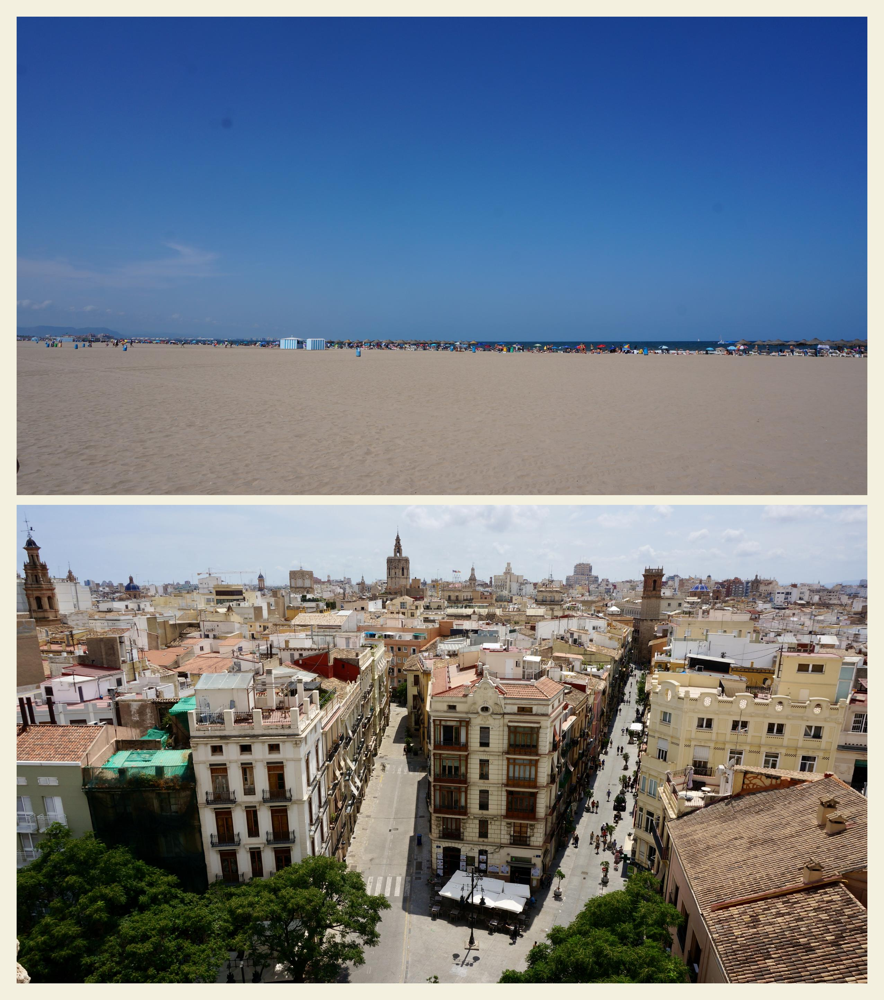

# gosei

Make a collage from two photos.

From two images, you make make a collage like below with one command.




# Installation

```bash
pip install gosei
```

# Run

```
gosei -a /path/to/first/image -b /path/to/second/image -o /save/path
```

# Limitations

- Only works with vertical photos in same size now
