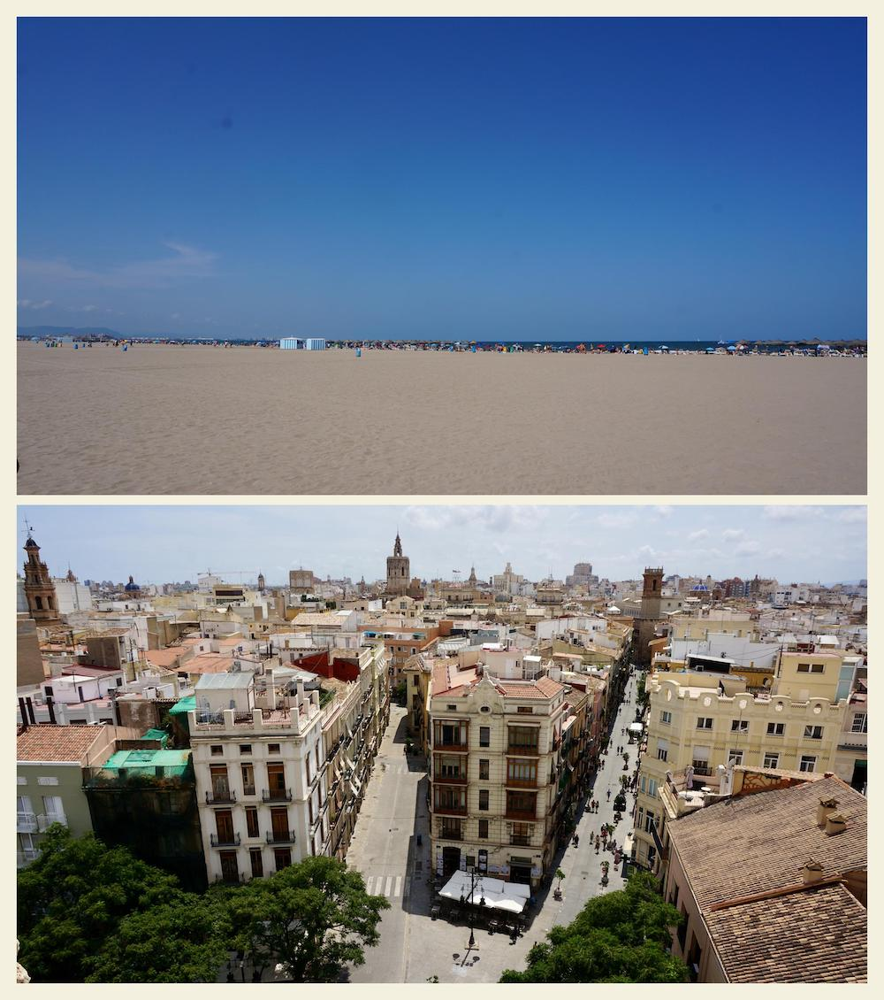

# gosei

Make a collage from two photos.

From two images, you make make a collage like below with one command.




# Installation

```bash
pip install gosei
```

# Run

```
gosei -a image_a.jpg -b image_b.jpg -o result.jpg
```

# Limitations

- Only works with vertical photos in same size now
